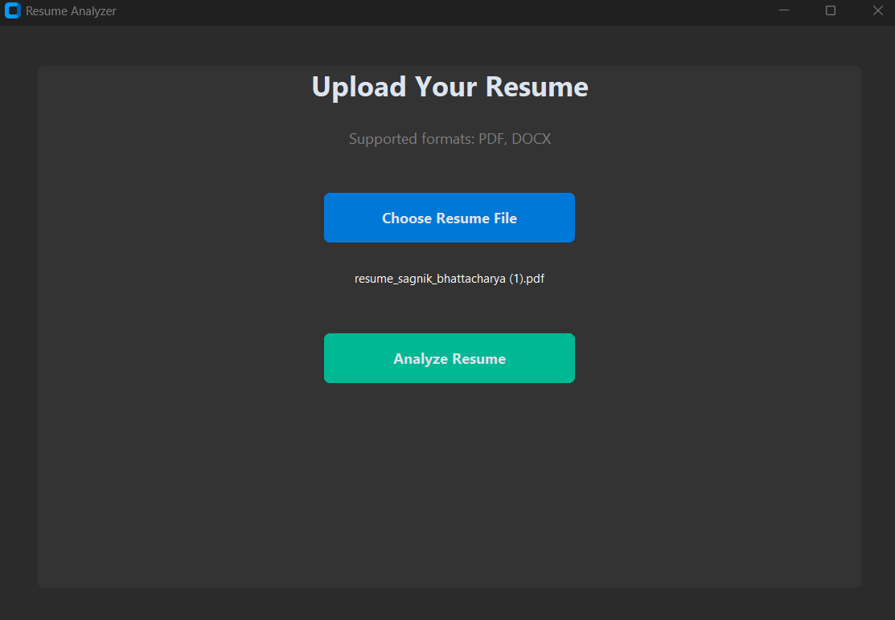
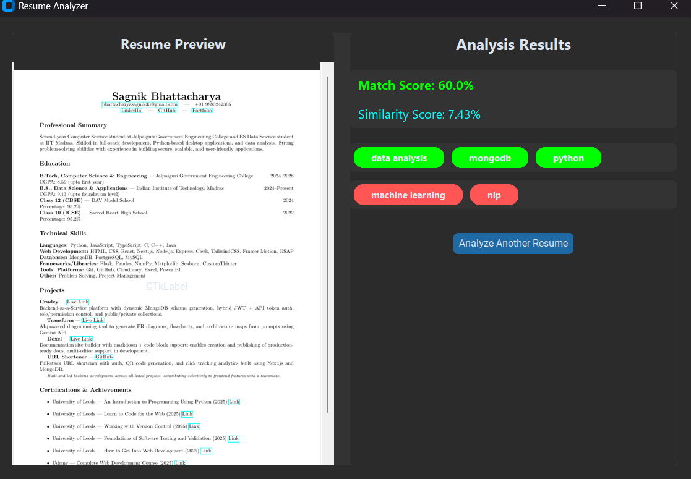

# 🧾 Resume Analyzer GUI

**Automated Resume Analyzer –** A professional desktop application built with **CustomTkinter** that analyzes resumes (PDF/DOCX), extracts skills, matches them against job requirements, and provides interactive visual insights including **multi-page PDF preview**, **skill highlights**, and detailed scoring.

---

## 🚀 Features

- **Multi-page PDF preview** with scroll and zoom
- **DOCX preview** (first 50 lines)
- **Skill matching** against a job description
- **Matched and missing skills** displayed as **color-coded pill-shaped tags**
- **Match and similarity scores**
- **Interactive buttons** with gradient and hover effects
- **Resume history** (via local MongoDB)
- Fully **offline and free**

---

## 📸 Screenshots

**Upload Screen**


**Result Screen**


---

## 💻 Tech Stack

* **Python 3.12+**
* **CustomTkinter** – Modern GUI framework
* **pdfplumber & python-docx** – Resume parsing
* **pdf2image & Pillow** – PDF preview
* **NLTK & scikit-learn** – Skill extraction & similarity scoring
* **PyMongo** – Local MongoDB storage

All dependencies are **free and open-source**.

---

## 🗂 Folder Structure

```

resume-analyzer-gui/
│
├── app/
│ ├── main.py # App entry point
│ ├── ui/ # GUI layer
│ │ ├── app.py # Main window
│ │ ├── screens/
│ │ │ ├── upload_screen.py
│ │ │ ├── result_screen.py
│ │ │ └── history_screen.py
│ │ ├── components/
│ │ │ ├── buttons.py
│ │ │ └── cards.py
│ │ └── theme.py
│ ├── core/ # Business logic
│ │ ├── analyzer.py
│ │ ├── matcher.py
│ │ └── scorer.py
│ ├── nlp/
│ │ ├── clean.py
│ │ ├── skills.py
│ │ └── similarity.py
│ ├── parsers/
│ │ ├── pdf.py
│ │ └── docx.py
│ ├── db/
│ │ ├── mongodb.py
│ │ ├── collections.py
│ │ └── indexes.py
│ ├── repositories/
│ │ └── resume_repo.py
│ ├── models/
│ │ └── resume.py
│ ├── services/
│ │ └── resume_service.py
│ ├── utils/
│ │ ├── logger.py
│ │ └── file_utils.py
│ └── data/
│ └── skills.json
├── tests/
├── assets/
│ └── result_screen.png
│ └── upload_screen.png
├── scripts/
├── requirements.txt
├── README.md
└── .gitignore

````

---

## ⚡ Installation

1. **Clone the repo**

```bash
git clone https://github.com/Sagnik-Bhattacharya/resume-analyzer-gui.git
cd resume-analyzer-gui
````

2. **Create virtual environment**

```bash
python -m venv venv
source venv/Scripts/activate   # Windows
# or
source venv/bin/activate       # Mac/Linux
```

3. **Install dependencies**

```bash
pip install -r requirements.txt
```

4. **Run the app**

```bash
python -m app.main
```

---

## 🧩 Usage

1. Launch the app → **Upload Screen** appears.
2. Choose a PDF or DOCX resume.
3. Click **Analyze Resume** → the result screen shows:

   - Multi-page PDF preview
   - Match score and similarity score
   - Matched and missing skills as pill-shaped tags

4. Click **Analyze Another Resume** to restart.

---

## 📦 Future Enhancements

- Drag & drop resume upload
- Resume history with clickable past analysis
- Charts for skill match visualization
- Semantic AI-based skill matching
- Export analysis summary to PDF/CSV

---

## 🛠 Dependencies

```text
customtkinter
pdfplumber
python-docx
pdf2image
Pillow
scikit-learn
nltk
pymongo
pytest
```
